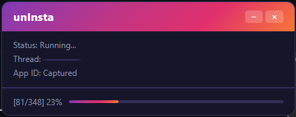
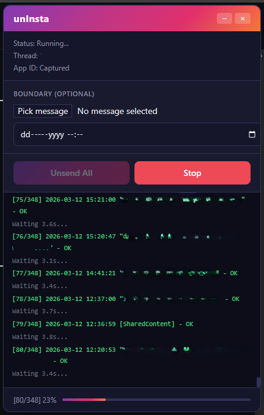

<p align="center">
  
</p>

<h1 align="center">unInsta</h1>

<p align="center">Bulk unsend your messages in Instagram DM conversations.</p>

<p align="center">
  
  &nbsp;
  
</p>

unInsta uses Instagram's internal API to iterate through all your messages in a conversation and unsend them one by one, with built-in rate limiting to avoid triggering Instagram's abuse detection.

## Features

- Unsend all your messages in the currently open DM conversation
- Set a boundary to only unsend messages newer than a specific date or message
- Auto-detects authentication from your active Instagram session
- Proactive rate limiting with jittered delays
- Floating panel with real-time log and progress tracking
- Works with Instagram's light and dark themes

## Install

Pick **one** of the two methods below -- you don't need both.

### Firefox -- Recommended

Install directly from [Mozilla Add-ons](https://addons.mozilla.org/en-US/firefox/addon/uninsta/).

### Chrome / Edge

1. Go to the [latest release](../../releases/latest)
2. Download `uninsta-extension.zip`
3. Unzip the file
4. Navigate to `chrome://extensions`
5. Enable "Developer mode"
6. Click "Load unpacked" and select the unzipped folder

### Tampermonkey

1. Install [Tampermonkey](https://www.tampermonkey.net/) for your browser
2. Go to the [latest release](../../releases/latest)
3. Download `uninsta.user.js`
4. Open Tampermonkey dashboard, click the "Utilities" tab
5. Under "Import from file", select the downloaded file

## Usage

1. Open Instagram and navigate to a DM conversation
2. Click the unInsta trigger button in the chat header (or the extension icon in the toolbar)
3. Optionally set a boundary (date or pick a specific message)
4. Click "Unsend All"
5. Watch the progress in the log panel

## How It Works

unInsta runs as a content script on `instagram.com/direct/*`. On load, it intercepts Instagram's own API requests to capture authentication credentials. When you click "Unsend All", it:

1. Reads your user ID from cookies
2. Extracts the thread ID from the URL
3. Fetches messages page by page via Instagram's REST API
4. Filters to only your own messages
5. Sends a delete request for each message with a ~3.5s jittered delay between requests
6. Handles rate limits (HTTP 429) automatically by backing off and retrying

## Building from Source

### Requirements

- **OS:** Any (Linux, macOS, Windows)
- **Node.js:** v22 or later ([download](https://nodejs.org/))
- **npm:** Included with Node.js (v10+)

### Steps

```bash
git clone https://github.com/dustfeather/uninsta.git
cd uninsta
npm install
npm run build
```

`npm run build` runs TypeScript type-checking (`tsc --noEmit`) then executes the build script (`tsx scripts/build.ts`), which uses esbuild to bundle and minify each entry point.

### Output

- `dist/uninsta-extension.zip` -- Chrome/Edge extension
- `dist/uninsta-extension.xpi` -- Firefox extension
- `dist/uninsta.user.js` -- Tampermonkey userscript
- `dist/extension/` -- Unpacked extension directory

## Acknowledgements

Inspired by [Undiscord](https://github.com/victornpb/undiscord) by victornpb, which does the same thing for Discord messages.

## License

[GPL-3.0](LICENSE)
